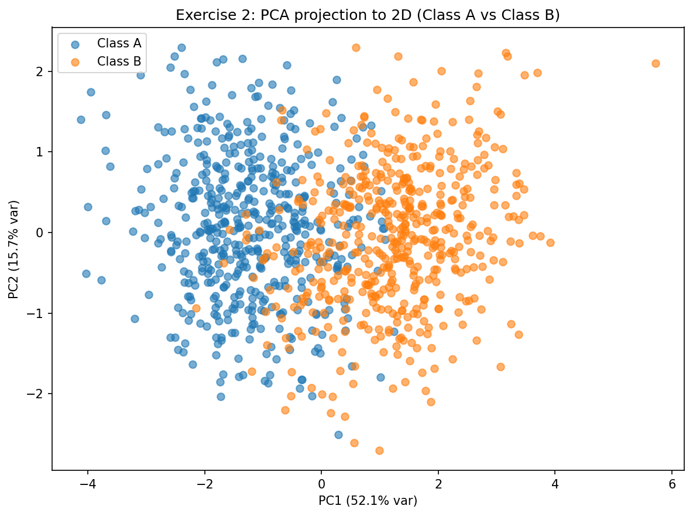
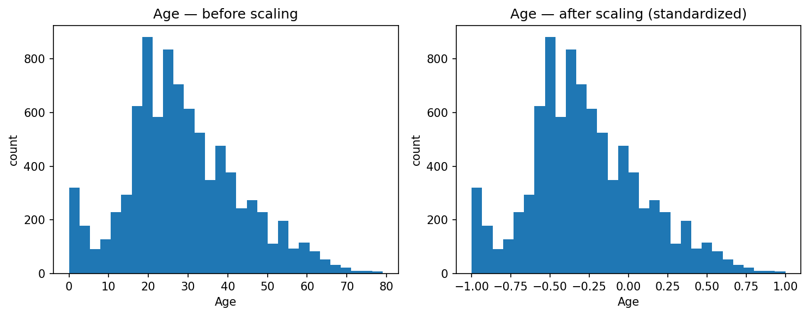
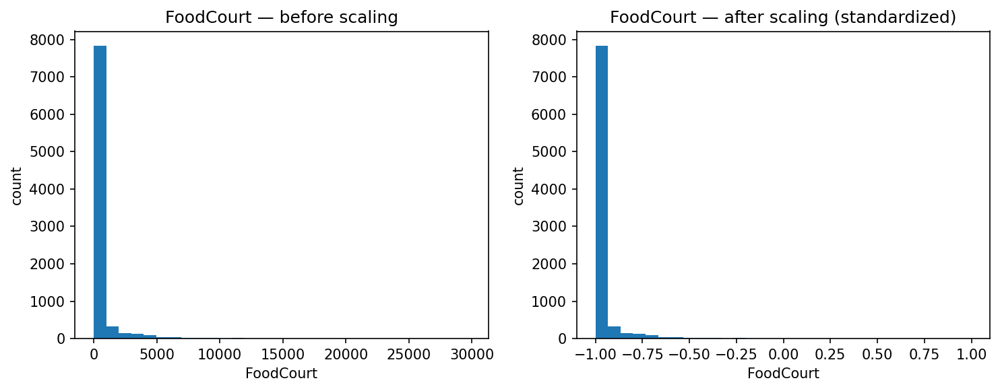

!!! success inline end "Deadline and Submission"

    :date: 05.sep (friday)
    
    :clock1: Commits until 23:59

    :material-account: Individual

    :simple-github: Submission the GitHub Pages' Link (yes, **only** the link for pages) via [insper.blackboard.com](https://insper.blackboard.com){:target="_blank"}.


**Activity: Data Preparation and Analysis for Neural Networks**

This activity is designed to test your skills in generating synthetic datasets, handling real-world data challenges, and preparing data to be fed into **neural networks**.

***

## Exercise 1

### **Exploring Class Separability in 2D**

Understanding how data is distributed is the first step before designing a network architecture. In this exercise, you will generate and visualize a two-dimensional dataset to explore how data distribution affects the complexity of the decision boundaries a neural network would need to learn.

### **Instructions**

1.  **Generate the Data:** Create a synthetic dataset with a total of 400 samples, divided equally among 4 classes (100 samples each). Use a Gaussian distribution to generate the points for each class based on the following parameters:
    * **Class 0:** Mean = $[2, 3]$, Standard Deviation = $[0.8, 2.5]$
    * **Class 1:** Mean = $[5, 6]$, Standard Deviation = $[1.2, 1.9]$
    * **Class 2:** Mean = $[8, 1]$, Standard Deviation = $[0.9, 0.9]$
    * **Class 3:** Mean = $[15, 4]$, Standard Deviation = $[0.5, 2.0]$
1.  **Plot the Data:** Create a 2D scatter plot showing all the data points. Use a different color for each class to make them distinguishable.
```python
import numpy as np
import pandas as pd
import matplotlib.pyplot as plt

np.random.seed(42)

# Number of samples per class
n_samples = 100  

# Class parameters: (mean, std)
class_params = {
    0: {"mean": [2, 3], "std": [0.8, 2.5]},
    1: {"mean": [5, 6], "std": [1.2, 1.9]},
    2: {"mean": [8, 1], "std": [0.9, 0.9]},
    3: {"mean": [15, 4], "std": [0.5, 2.0]}
}

# Store all samples
data = []
labels = []

for label, params in class_params.items():
    mean = params["mean"]
    std = params["std"]
    
    # Generate Gaussian distributed samples
    x = np.random.normal(mean[0], std[0], n_samples)
    y = np.random.normal(mean[1], std[1], n_samples)
    
    # Stack into dataset
    samples = np.column_stack((x, y))
    data.append(samples)
    labels.extend([label] * n_samples)

# Combine into full dataset
data = np.vstack(data)
labels = np.array(labels)

# Put into a DataFrame
df = pd.DataFrame(data, columns=["x1", "x2"])
df["class"] = labels

# Visualization
plt.figure(figsize=(8,6))
for label in class_params.keys():
    subset = df[df["class"] == label]
    plt.scatter(subset["x1"], subset["x2"], label=f"Class {label}", alpha=0.6)

plt.legend()
plt.xlabel("x1")
plt.ylabel("x2")
plt.title("Synthetic Gaussian Dataset (4 classes)")
# Save image
plt.savefig("synthetic_gaussian_dataset.png")
```

    

1.  **Analyze and Draw Boundaries:**
    1. Examine the scatter plot carefully. Describe the distribution and overlap of the four classes.
        - Class 0 has a spread across most of the vertical axis and and is between 0.0 and 4.0 horizontally. Slightly overlaps Class 1

        - Class 0 has a diagonal spread, between 2 and 10 vertically as well as horizontally. Slightly overlaps Class 0 in a few points and Class 2 in fewer points.

        - Class 2 is very concentrated and relatvely isolated from other classes.

        - Class 3 is completely isolated, spread vertically along and the furthest in the x axis.

    1. Based on your visual inspection, could a simple, linear boundary separate all classes?
        - A linear boundary is capable of mostly separating all classes (with some missclassified points), but because of the overlaps between class 0 and 1, a perfect and clean linear separation would fail.
    1. On your plot, sketch the decision boundaries that you think a trained neural network might learn to separate these classes.

        - By adding the following code to the earlier plot, we can approximate some separations between classes
        ```python
        # three hand-drawn separators 
        plt.plot([6.0, 0.6], [-2.0, 10.0], linestyle="--", linewidth=2, color="k", label="approx. boundary")  # between 0 & 1
        plt.plot([4.0, 12.0], [2.0, 5.0], linestyle="--", linewidth=2, color="k")                            # between 1 & 2
        plt.plot([12.0, 12.0], [-1, 9], linestyle="--", linewidth=2, color="k")                             # isolate class 3
        ```
        

***

## Exercise 2

### **Non-Linearity in Higher Dimensions**

Simple neural networks (like a Perceptron) can only learn linear boundaries. Deep networks excel when data is not linearly separable. This exercise challenges you to create and visualize such a dataset.

### **Instructions**

1.  **Generate the Data:** Create a dataset with 500 samples for Class A and 500 samples for Class B. Use a multivariate normal distribution with the following parameters:

    * **Class A:**

        Mean vector:

        $$\mu_A = [0, 0, 0, 0, 0]$$

        Covariance matrix:

        $$
        \Sigma_A = \begin{pmatrix}
        1.0 & 0.8 & 0.1 & 0.0 & 0.0 \\
        0.8 & 1.0 & 0.3 & 0.0 & 0.0 \\
        0.1 & 0.3 & 1.0 & 0.5 & 0.0 \\
        0.0 & 0.0 & 0.5 & 1.0 & 0.2 \\
        0.0 & 0.0 & 0.0 & 0.2 & 1.0
        \end{pmatrix}
        $$

    * **Class B:**

        Mean vector:
            
        $$\mu_B = [1.5, 1.5, 1.5, 1.5, 1.5]$$
        
        Covariance matrix:

        $$
        \Sigma_B = \begin{pmatrix}
        1.5 & -0.7 & 0.2 & 0.0 & 0.0 \\
        -0.7 & 1.5 & 0.4 & 0.0 & 0.0 \\
        0.2 & 0.4 & 1.5 & 0.6 & 0.0 \\
        0.0 & 0.0 & 0.6 & 1.5 & 0.3 \\
        0.0 & 0.0 & 0.0 & 0.3 & 1.5
        \end{pmatrix}
        $$

1.  **Visualize the Data:** Since you cannot directly plot a 5D graph, you must reduce its dimensionality.
    * Use a technique like **Principal Component Analysis (PCA)** to project the 5D data down to 2 dimensions.
    * Create a scatter plot of this 2D representation, coloring the points by their class (A or B).
        ```python
        import numpy as np
        import pandas as pd
        import matplotlib.pyplot as plt
        from sklearn.preprocessing import StandardScaler
        from sklearn.decomposition import PCA


        # set experimen seed
        np.random.seed(42)

        # number of samples
        n_a = 500
        n_b = 500

        # Parameters for Class A
        mu_A = np.array([0, 0, 0, 0, 0])
        Sigma_A = np.array([
            [1.0, 0.8, 0.1, 0.0, 0.0],
            [0.8, 1.0, 0.3, 0.0, 0.0],
            [0.1, 0.3, 1.0, 0.5, 0.0],
            [0.0, 0.0, 0.5, 1.0, 0.2],
            [0.0, 0.0, 0.0, 0.2, 1.0],
        ])

        # Parameters for Class B
        mu_B = np.array([1.5, 1.5, 1.5, 1.5, 1.5])
        Sigma_B = np.array([
            [1.5, -0.7, 0.2, 0.0, 0.0],
            [-0.7, 1.5, 0.4, 0.0, 0.0],
            [0.2,  0.4, 1.5, 0.6, 0.0],
            [0.0,  0.0, 0.6, 1.5, 0.3],
            [0.0,  0.0, 0.0, 0.3, 1.5],
        ])

        # Generate Data
        A = np.random.multivariate_normal(mean=mu_A, cov=Sigma_A, size=n_a)
        B = np.random.multivariate_normal(mean=mu_B, cov=Sigma_B, size=n_b)

        # Combine into one dataset
        X = np.vstack([A, B])
        y = np.array([0] * n_a + [1] * n_b)  # 0 = Class A, 1 = Class B

        # Put into DataFrame
        df = pd.DataFrame(X, columns=[f"x{i+1}" for i in range(5)])
        df["class"] = y


        # Standardize features
        scaler = StandardScaler()
        X_std = scaler.fit_transform(df[[f"x{i+1}" for i in range(5)]])

        # PCA projection to 2D
        pca = PCA(n_components=2, random_state=42)
        X_pca = pca.fit_transform(X_std)
        evr = pca.explained_variance_ratio_ 

        # ---------- Plot ----------
        plt.figure(figsize=(8, 6))
        plt.scatter(X_pca[y == 0, 0], X_pca[y == 0, 1], alpha=0.6, label="Class A")
        plt.scatter(X_pca[y == 1, 0], X_pca[y == 1, 1], alpha=0.6, label="Class B")
        plt.xlabel(f"PC1 ({evr[0]*100:.1f}% var)")
        plt.ylabel(f"PC2 ({evr[1]*100:.1f}% var)")
        plt.title("Exercise 2: PCA projection to 2D (Class A vs Class B)")
        plt.legend()
        plt.tight_layout()
        plt.savefig("exercise2_pca_scatter.png", dpi=150, bbox_inches="tight")
        print("Saved PCA figure to exercise2_pca_scatter.png")
        plt.show()
        ```
    

1.  **Analyze the Plots:**
    1. Based on your 2D projection, describe the relationship between the two classes.
        - Both classes have similar vertical spreads. Horizontally, class A is concentrated mostly on negative values, and Class B on positive values. They both overlap between -2 and 2 within PC1 axis
    1. Discuss the **linear separability** of the data. Explain why this type of data structure poses a challenge for simple linear models and would likely require a multi-layer neural network with non-linear activation functions to be classified accurately.
        - Linear models use a hyperplane to separate the data, but when classes are intertwined like shown in the image, this fails, since a hyperplane capable of separating the classes doesn't exist. 

***

## Exercise 3

### **Preparing Real-World Data for a Neural Network**

This exercise uses a real dataset from Kaggle. Your task is to perform the necessary preprocessing to make it suitable for a neural network that uses the hyperbolic tangent (`tanh`) activation function in its hidden layers.

### **Instructions**

1.  **Get the Data:** Download the [**Spaceship Titanic**](https://www.kaggle.com/competitions/spaceship-titanic){:target="_blank"} dataset from Kaggle.
2.  **Describe the Data:**
    * Briefly describe the dataset's objective (i.e., what does the `Transported` column represent?).
        - The dataset comes from the Kaggle competition: Spaceship Titanic. The dataset consists of records recovered from the spaceship's damaged computer system after the ship collided with an anomaly. The objective of the competition and consequently, the data, is to be able to predict which passengers were transported to an alternate dimension by the anomaly
    * List the features and identify which are **numerical** (e.g., `Age`, `RoomService`) and which are **categorical** (e.g., `HomePlanet`, `Destination`).
    ```python
    import pandas as pd

    # Load dataset (adjust path to your train.csv)
    df = pd.read_csv("./docs/exercise1/titanic_dataset/train.csv")


    # List all columns
    print("\nColumns in dataset:")
    print(df.columns.tolist())

    # Show data types and non-null counts
    print("\nInfo about dataset:")
    print(df.info())


    # Quick separation into numerical vs categorical
    numerical_cols = df.select_dtypes(include=["int64", "float64"]).columns.tolist()
    categorical_cols = df.select_dtypes(include=["object", "bool"]).columns.tolist()

    print("\nNumerical features:", numerical_cols)
    print("Categorical features:", categorical_cols)
    ```
    ```
    Numerical features: ['Age', 'RoomService', 'FoodCourt', 'ShoppingMall', 'Spa', 'VRDeck']
    Categorical features: ['PassengerId', 'HomePlanet', 'CryoSleep', 'Cabin', 'Destination', 'VIP', 'Name', 'Transported']
    ```
    * Investigate the dataset for **missing values**. Which columns have them, and how many?
    ```python
    # Summary of missing values
    print("\nMissing values per column:")
    print(df.isna().sum())
    ```
    ```
    Missing values per column:
    PassengerId       0
    HomePlanet      201
    CryoSleep       217
    Cabin           199
    Destination     182
    Age             179
    VIP             203
    RoomService     181
    FoodCourt       183
    ShoppingMall    208
    Spa             183
    VRDeck          188
    Name            200
    Transported       0
    dtype: int64
    ```
3.  **Preprocess the Data:** Your goal is to clean and transform the data so it can be fed into a neural network. The `tanh` activation function produces outputs in the range `[-1, 1]`, so your input data should be scaled appropriately for stable training.
    * **Handle Missing Data:** Devise and implement a strategy to handle the missing values in all the affected columns. Justify your choices.
    * **Encode Categorical Features:** Convert categorical columns like `HomePlanet`, `CryoSleep`, and `Destination` into a numerical format. One-hot encoding is a good choice.
    * **Normalize/Standardize Numerical Features:** Scale the numerical columns (e.g., `Age`, `RoomService`, etc.). Since the `tanh` activation function is centered at zero and outputs values in `[-1, 1]`, **Standardization** (to mean 0, std 1) or **Normalization** to a `[-1, 1]` range are excellent choices. Implement one and explain why it is a good practice for training neural networks with this activation function.
4.  **Visualize the Results:**
    * Create histograms for one or two numerical features (like `FoodCourt` or `Age`) **before** and **after** scaling to show the effect of your transformation.

**Methods for 3 and 4:**

- Numerical features (Age, RoomService, FoodCourt, ShoppingMall, Spa, VRDeck) were imputed with the median value of each column. Using median instead of mean makes it less likely that outliers influence the results.
- Categorical features (HomePlanet, CryoSleep, Destination, VIP) were imputed with the mode (most frequent value). THis preserves the most common class for each feature
- Dropped columns: Cabin and Name were removed. Name does not offer any useful information and Cabin is very complex, not usable without heavy feature engineering, so dropped for simplicity.
- Binary variables (CryoSleep, VIP) were converted into 0/1 integers. This allows direct use as inputs in a neural network.
- Nominal categorical variables (HomePlanet, Destination) were transformed using one-hot encoding. This removes ordinal bias by making each category a separate feature.
- All numerical features were scaled to [-1, 1] using Min–Max normalization. The tanh activation function outputs values in the range [-1, 1] so this process scales the inputs to the required range.

This is the code that combines all of the mentioned methos and generates histograms for the `Age` and `FoodCourt` columns:
```Python
import pandas as pd
from sklearn.model_selection import train_test_split
from sklearn.preprocessing import StandardScaler
from sklearn.preprocessing import MinMaxScaler
import matplotlib.pyplot as plt

# Load dataset
df = pd.read_csv("./docs/exercise1/titanic_dataset/train.csv")

# Handle Missing Data

# Numerical: fill with median
num_cols = ["Age", "RoomService", "FoodCourt", "ShoppingMall", "Spa", "VRDeck"]
for col in num_cols:
    df[col] = df[col].fillna(df[col].median())

# Categorical: fill with mode
cat_cols = ["HomePlanet", "CryoSleep", "Destination", "VIP"]
for col in cat_cols:
    # make column string dtype
    df[col] = df[col].astype("string")
    # fill NaN with mode and convert to string dtype
    df[col] = df[col].fillna(df[col].mode(dropna=True)[0]).astype(str)

# Drop Cabin and Name
df.drop(["Cabin", "Name"], axis=1, inplace=True)

# Convert CryoSleep and VIP from True/False strings to 0/1 ints
df["CryoSleep"] = df["CryoSleep"].map({"True": 1, "False": 0})
df["VIP"] = df["VIP"].map({"True": 1, "False": 0})

# Encode Categorical
df["CryoSleep"] = df["CryoSleep"].astype(int)
df["VIP"] = df["VIP"].astype(int)

# One-hot encode categorical vars
df = pd.get_dummies(df, columns=["HomePlanet", "Destination"], drop_first=True)

# Capture copy BEFORE scaling
pre_scale_num = df[num_cols].copy()

# Scale Numerical Features
scaler = MinMaxScaler(feature_range=(-1, 1))
df[num_cols] = scaler.fit_transform(df[num_cols].astype("float64"))

print(df.head())

# histograms before vs after
features_to_show = ["Age", "FoodCourt"]  # pick any subset of num_cols

for col in features_to_show:
    if col in pre_scale_num.columns:
        fig, ax = plt.subplots(1, 2, figsize=(10, 4), sharex=False, sharey=False)
        ax[0].hist(pre_scale_num[col].dropna(), bins=30)
        ax[0].set_title(f"{col} — before scaling")
        ax[0].set_xlabel(col); ax[0].set_ylabel("count")

        ax[1].hist(df[col].dropna(), bins=30)
        ax[1].set_title(f"{col} — after scaling (standardized)")
        ax[1].set_xlabel(col); ax[1].set_ylabel("count")

        plt.tight_layout()
        # Save figures
        plt.savefig(f"hist_{col.lower()}_before_after.png", dpi=150, bbox_inches="tight")
        plt.show()

```

This are the histograms generated by this code:



***

## **Evaluation Criteria**

The deliverable for this activity consists of a **report** that includes:

1. A brief description of your approach to each exercise.
1. The code used to generate the datasets, preprocess the data, and create the visualizations. With comments explaining each step.
1. The plots and visualizations requested in each exercise.
1. Your analysis and answers to the questions posed in each exercise.

**Important Notes:**

- The deliverable must be submitted in the format specified: **GitHub Pages**. **No other formats will be accepted.** - there exists a template for the course that you can use to create your GitHub Pages - [template](https://hsandmann.github.io/documentation.template/){target='_blank'};

- There is a **strict policy against plagiarism**. Any form of plagiarism will result in a zero grade for the activity and may lead to further disciplinary actions as per the university's academic integrity policies;

- **The deadline for each activity is not extended**, and it is expected that you complete them within the timeframe provided in the course schedule - **NO EXCEPTIONS** will be made for late submissions.

- **AI Collaboration is allowed**, but each student **MUST UNDERSTAND** and be able to explain all parts of the code and analysis submitted. Any use of AI tools must be properly cited in your report. ^^**ORAL EXAMS**^^ may require you to explain your work in detail.

- All deliverables for individual activities should be submitted through the course platform [insper.blackboard.com](http://insper.blackboard.com/){:target="_blank"}.

**Grade Criteria:**

**Exercise 1 (3 points):**

| Criteria | Description |
|:--------:|-------------|
| **1 pt** | Data is generated correctly and visualized in a clear scatter plot with proper labels and colors. |
| **2 pts** | The analysis of class separability is accurate, and the proposed decision boundaries are logical and well-explained in the context of what a network would learn. |

**Exercise 2 (3 points):**

| Criteria | Description |
|:--------:|-------------|
| **1 pt** | Data is generated correctly using the specified multivariate parameters. |
| **1 pt** | Dimensionality reduction is applied correctly, and the resulting 2D projection is clearly plotted. |
| **1 pt** | The analysis correctly identifies the non-linear relationship and explains why a neural network would be a suitable model. |

**Exercise 3 (4 points):**

| Criteria | Description |
|:--------:|-------------|
| **1 pt** | The data is correctly loaded, and its characteristics are accurately described. |
| **2 pts** | All preprocessing steps (handling missing data, encoding, and appropriate feature scaling for `tanh`) are implemented correctly and with clear justification for a neural network context. |
| **1 pt** | Visualizations effectively demonstrate the impact of the data preprocessing. |
