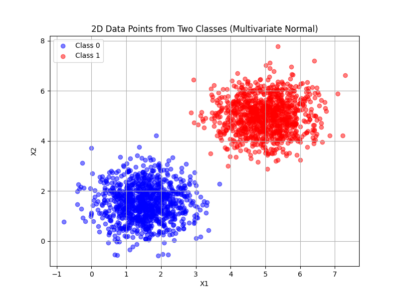
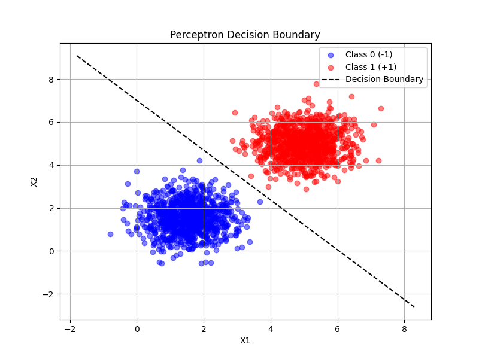
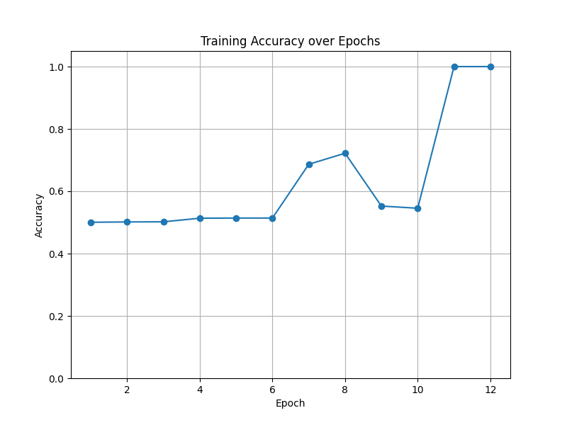
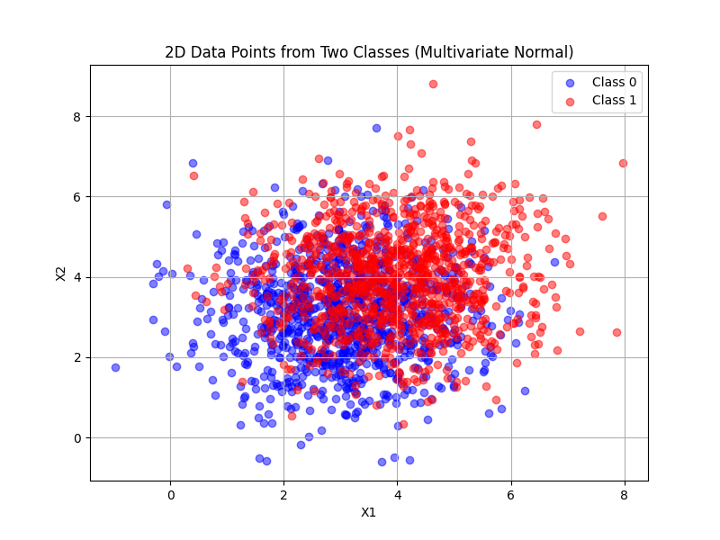
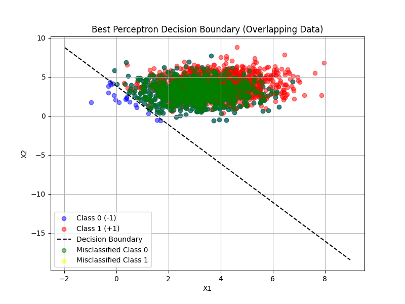
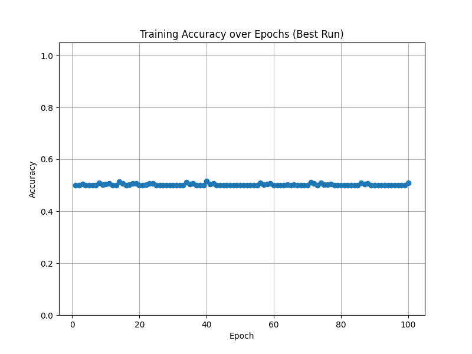

!!! success inline end "Deadline and Submission"

    :date: 14.sep (sunday)
    
    :clock1: Commits until 23:59

    :material-account: Individual

    :simple-github: Submission the GitHub Pages' Link (yes, **only** the link for pages) via [insper.blackboard.com](https://insper.blackboard.com){:target="_blank"}.

**Activity: Understanding Perceptrons and Their Limitations**

This activity is designed to test your skills in Perceptrons and their limitations.

***

## Exercise 1

### **Data Generation Task:** 

Generate two classes of 2D data points (1000 samples per class) using multivariate normal distributions. Use the following parameters:  

- Class 0:

    Mean = $[1.5, 1.5]$,
    
    Covariance matrix = $[[0.5, 0], [0, 0.5]]$ (i.e., variance of $0.5$ along each dimension, no covariance).  

- Class 1:

    Mean = $[5, 5]$,
    
    Covariance matrix = $[[0.5, 0], [0, 0.5]]$.  

These parameters ensure the classes are mostly linearly separable, with minimal overlap due to the distance between means and low variance. Plot the data points (using libraries like matplotlib if desired) to visualize the separation, coloring points by class.

We can use the following code to generate and plot the points:
```Python
def generate_and_plot():
    # Parameters for Class 0
    mean_class0 = [1.5, 1.5]
    cov_class0 = [[0.5, 0], [0, 0.5]]

    # Parameters for Class 1
    mean_class1 = [5, 5]
    cov_class1 = [[0.5, 0], [0, 0.5]]

    # Fix random seed for reproducibility
    np.random.seed(42)

    # Generate 1000 samples per class
    class0_samples = np.random.multivariate_normal(mean_class0, cov_class0, 1000)
    class1_samples = np.random.multivariate_normal(mean_class1, cov_class1, 1000)

    # Plot the two classes
    plt.figure(figsize=(8, 6))
    plt.scatter(class0_samples[:, 0], class0_samples[:, 1], 
                c='blue', alpha=0.5, label="Class 0")
    plt.scatter(class1_samples[:, 0], class1_samples[:, 1], 
                c='red', alpha=0.5, label="Class 1")

    plt.title("2D Data Points from Two Classes (Multivariate Normal)")
    plt.xlabel("X1")
    plt.ylabel("X2")
    plt.legend()
    plt.grid(True)
    #plt.show()
    # Save the image as a png file
    plt.savefig("exercise2_ex1_plot.png")
    # Return values for reuse
    return class0_samples, class1_samples
```

The following is the resulting plot of the classes:

### **Perceptron Implementation Task:**

Implement a single-layer perceptron from scratch to classify the generated data into the two classes. You may use NumPy only for basic linear algebra operations (e.g., matrix multiplication, vector addition/subtraction, dot products). Do not use any pre-built machine learning libraries (e.g., no scikit-learn) or NumPy functions that directly implement perceptron logic.  

- Initialize weights (w) as a 2D vector (plus a bias term b).  
- Use the perceptron learning rule: For each misclassified sample $(x, y)$, update $w = w + η * y * x$ and $b = b + η * y$, where $η$ is the learning rate (start with $η=0.01$).  
- Train the model until convergence (no weight updates occur in a full pass over the dataset) or for a maximum of 100 epochs, whichever comes first. If convergence is not achieved by 100 epochs, report the accuracy at that point. Track accuracy after each epoch.  
- After training, evaluate accuracy on the full dataset and plot the decision boundary (line defined by $w·x + b = 0$) overlaid on the data points. Additionally, plot the training accuracy over epochs to show convergence progress. Highlight any misclassified points in a separate plot or by different markers in the decision boundary plot.  

Report the final weights, bias, accuracy, and discuss why the data's separability leads to quick convergence.

The following code can be used to implment and train a perceptron:

```Python
# Perceptron implementation
def perceptron_train(X, y, lr=0.01, max_epochs=100):
    n_samples, n_features = X.shape
    w = np.zeros(n_features)   # weight vector
    b = 0.0                    # bias term
    accuracies = []

    for epoch in range(max_epochs):
        errors = 0
        for i in range(n_samples):
            activation = np.dot(w, X[i]) + b
            y_pred = 1 if activation >= 0 else -1
            if y_pred != y[i]:
                # Update rule
                w += lr * y[i] * X[i]
                b += lr * y[i]
                errors += 1

        # Track accuracy
        activation = np.dot(X, w) + b
        predictions = np.where(activation >= 0, 1, -1)
        acc = np.mean(predictions == y)
        accuracies.append(acc)

        if errors == 0:  # converged
            print(f"Converged after {epoch+1} epochs.")
            break

    return w, b, accuracies, predictions
```
We can use that code, to train a perceptron based to the parameters specified by the exercise, and plot the relevant graphs:
```Python
# Generate data
X, y, class0_samples, class1_samples = generate_data()

# Train perceptron
w, b, accuracies, final_predictions = perceptron_train(X, y)

# Results
print("\nFinal Results:")
print("Weights:", w)
print("Bias:", b)
print("Final Accuracy:", accuracies[-1])

# Plot decision boundary
x_min, x_max = X[:, 0].min() - 1, X[:, 0].max() + 1
xx = np.linspace(x_min, x_max, 100)
yy = -(w[0] * xx + b) / w[1]  # line equation

plt.figure(figsize=(8, 6))
plt.scatter(class0_samples[:, 0], class0_samples[:, 1], c='blue', alpha=0.5, label="Class 0 (-1)")
plt.scatter(class1_samples[:, 0], class1_samples[:, 1], c='red', alpha=0.5, label="Class 1 (+1)")
plt.plot(xx, yy, 'k--', label="Decision Boundary")

# Misclassified points
misclassified = X[final_predictions != y]
if len(misclassified) > 0:
    plt.scatter(misclassified[:, 0], misclassified[:, 1],
                edgecolors='yellow', facecolors='none', s=80, label="Misclassified")

plt.title("Perceptron Decision Boundary")
plt.xlabel("X1")
plt.ylabel("X2")
plt.legend()
plt.grid(True)
plt.show()

# Plot training accuracy
plt.figure(figsize=(8, 6))
plt.plot(range(1, len(accuracies) + 1), accuracies, marker='o')
plt.title("Training Accuracy over Epochs")
plt.xlabel("Epoch")
plt.ylabel("Accuracy")
plt.ylim(0, 1.05)
plt.grid(True)
plt.show()
```

This is the resulting decision boundary:


This is the training accuracy over each epoch:


It is worth mentioning that since the data used is linearly separable, the perceptron is able to perfectly classify the points given.
## Exercise 2

### **Data Generation Task:**  

Generate two classes of 2D data points (1000 samples per class) using multivariate normal distributions. Use the following parameters:

- Class 0:

    Mean = $[3, 3]$,

    Covariance matrix = $[[1.5, 0], [0, 1.5]]$ (i.e., higher variance of 1.5 along each dimension).

- Class 1:

    Mean = $[4, 4]$,

    Covariance matrix = $[[1.5, 0], [0, 1.5]]$.  

These parameters create partial overlap between classes due to closer means and higher variance, making the data not fully linearly separable. Plot the data points to visualize the overlap, coloring points by class.

Using the same method as the first exercise, while changing the parameters, we get the following data:

Notice how in this case, both classes overlap in a number of areas.
### **Perceptron Implementation Task:**  

Using the same implementation guidelines as in Exercise 1, train a perceptron on this dataset.  

- Follow the same initialization, update rule, and training process.  
- Train the model until convergence (no weight updates occur in a full pass over the dataset) or for a maximum of 100 epochs, whichever comes first. If convergence is not achieved by 100 epochs, report the accuracy at that point and note any oscillation in updates; consider reporting the best accuracy achieved over multiple runs (e.g., average over 5 random initializations). Track accuracy after each epoch.  
- Evaluate accuracy after training and plot the decision boundary overlaid on the data points. Additionally, plot the training accuracy over epochs to show convergence progress (or lack thereof). Highlight any misclassified points in a separate plot or by different markers in the decision boundary plot.  

Report the final weights, bias, accuracy, and discuss how the overlap affects training compared to Exercise 1 (e.g., slower convergence or inability to reach 100% accuracy).

Since this case is not linearly separable, and the training may vary in result, we can add random initialization of the weights and bias, this is the new perceptron training function to account for that:
```Python
# Perceptron implementation
def perceptron_train(X, y, lr=0.01, max_epochs=100, random_init=False):
    n_samples, n_features = X.shape
    # Initialize weights randomly or zeros
    if random_init:
        w = np.random.randn(n_features) * 0.01
        b = np.random.randn() * 0.01
    else:
        w = np.zeros(n_features)
        b = 0.0           # bias term
    accuracies = []

    for epoch in range(max_epochs):
        errors = 0
        for i in range(n_samples):
            activation = np.dot(w, X[i]) + b
            y_pred = 1 if activation >= 0 else -1
            if y_pred != y[i]:
                # Update rule
                w += lr * y[i] * X[i]
                b += lr * y[i]
                errors += 1

        # Track accuracy
        activation = np.dot(X, w) + b
        predictions = np.where(activation >= 0, 1, -1)
        acc = np.mean(predictions == y)
        accuracies.append(acc)

        if errors == 0:  # converged
            print(f"Converged after {epoch+1} epochs.")
            break 
    return w, b, accuracies, predictions
```

Accounting for this change, this is reflected in the main code as follows:
```Python
# Generate data
X, y, class0_samples, class1_samples = generate_data()

# Train perceptron
all_runs_acc = []
best_run = None

for run in range(5):
    w, b, accuracies, final_predictions = perceptron_train(X, y, lr=0.01, max_epochs=100, random_init=True)
    final_acc = accuracies[-1]
    all_runs_acc.append(final_acc)

    if best_run is None or final_acc > best_run["acc"]:
        best_run = {"w": w, "b": b, "acc": final_acc, "acc_list": accuracies, "pred": final_predictions}


# Results
print("\nSummary over 5 runs:")
print("Accuracies per run:", all_runs_acc)
print("Average accuracy:", np.mean(all_runs_acc))
print("Best accuracy:", best_run["acc"])
print("Best weights:", best_run["w"])
print("Best bias:", best_run["b"])


# Plot decision boundary of best run
x_min, x_max = X[:, 0].min() - 1, X[:, 0].max() + 1
xx = np.linspace(x_min, x_max, 100)
yy = -(best_run["w"][0] * xx + best_run["b"]) / best_run["w"][1]

plt.figure(figsize=(8, 6))
plt.scatter(class0_samples[:, 0], class0_samples[:, 1], 
            c='blue', alpha=0.5, label="Class 0 (-1)")
plt.scatter(class1_samples[:, 0], class1_samples[:, 1], 
            c='red', alpha=0.5, label="Class 1 (+1)")
plt.plot(xx, yy, 'k--', label="Decision Boundary")

# Misclassified points separated by class
misclassified = X[best_run["pred"] != y]
misclassified_labels = y[best_run["pred"] != y]

# Class 0 misclassified (true label = -1)
plt.scatter(misclassified[misclassified_labels == -1][:, 0],
            misclassified[misclassified_labels == -1][:, 1],
            c='green', alpha=0.5, label="Misclassified Class 0")

# Class 1 misclassified (true label = +1)
plt.scatter(misclassified[misclassified_labels == 1][:, 0],
            misclassified[misclassified_labels == 1][:, 1],
            c='yellow', alpha=0.5, label="Misclassified Class 1")

plt.title("Best Perceptron Decision Boundary")
plt.xlabel("X1")
plt.ylabel("X2")
plt.legend()
plt.grid(True)

plt.savefig("exercise2_ex2_perceptron_accuracy.png")
```

This is the decision boundary generated by this code, with highlighted missclassified points in different colors:


Due to the classes being closer together, even overlapping in a few situations, a perceptron has difficulty in finding a good separation of the data, in the case shown by the image, the perceptron seemed to favor guessing Class 1, missclassifying most of Class 0 points.

This can be reinforced by analyzing the accuracy throughout the epochs, that remained consistently around 50%, showing the difficulty that the perceptron while performing with non linearly separable data.


## **Evaluation Criteria**

!!! failure "Usage of Toolboxes"

    You may use toolboxes (e.g., NumPy) ==ONLY for matrix operations and calculations== during this activity. All other computations, including activation functions, loss calculations, gradients, and the forward pass, ==**MUST BE IMPLEMENTED** within your Perceptron== code. The use of ==third-party libraries for the Perceptron implementation **IS STRICTLY PROHIBITED**==.

    **Failure to comply with these instructions will result in your submission being rejected.**

The deliverable for this activity consists of a **report** that includes:


**Important Notes:**

- The deliverable must be submitted in the format specified: **GitHub Pages**. **No other formats will be accepted.** - there exists a template for the course that you can use to create your GitHub Pages - [template](https://hsandmann.github.io/documentation.template/){target='_blank'};

- There is a **strict policy against plagiarism**. Any form of plagiarism will result in a zero grade for the activity and may lead to further disciplinary actions as per the university's academic integrity policies;

- **The deadline for each activity is not extended**, and it is expected that you complete them within the timeframe provided in the course schedule - **NO EXCEPTIONS** will be made for late submissions.

- **AI Collaboration is allowed**, but each student **MUST UNDERSTAND** and be able to explain all parts of the code and analysis submitted. Any use of AI tools must be properly cited in your report. **ORAL EXAMS** may require you to explain your work in detail.

- All deliverables for individual activities should be submitted through the course platform [insper.blackboard.com](http://insper.blackboard.com/){:target="_blank"}.


**Grade Criteria:**

| Criteria | Description |
|:--------:|-------------|
| **4 pts** | Correctness of the perceptron implementation |
| **2 pts** | Exercise 1: Data generation, training, evaluation, and analysis. |
| **2 pts** | Exercise 2: Data generation, training, evaluation, and analysis. |
| **1 pt** | Visualizations: Quality and clarity of plots (data distribution, decision boundary, accuracy over epochs). |
| **1 pt** | Report Quality: Clarity, organization, and completeness of the report. |