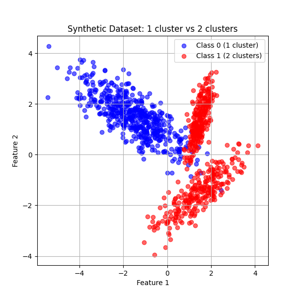
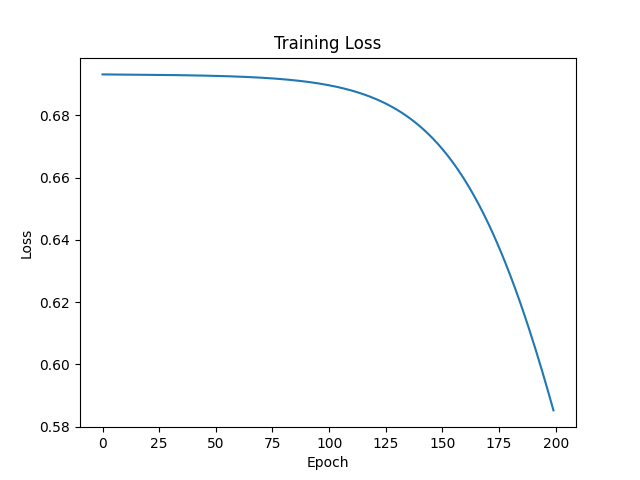
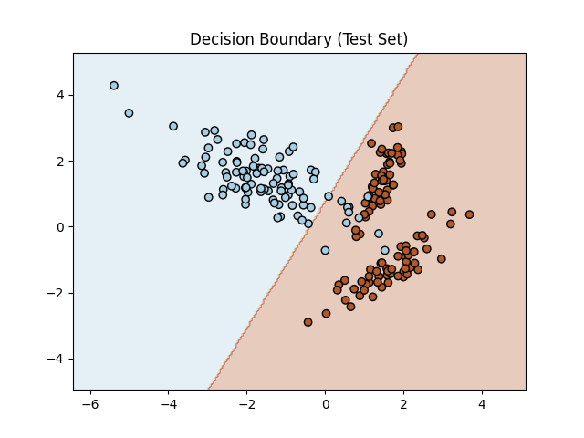

!!! success inline end "Deadline and Submission"

    :date: 21.sep (sunday)
    
    :clock1: Commits until 23:59

    :material-account: Individual

    :simple-github: Submission the GitHub Pages' Link (yes, **only** the link for pages) via [insper.blackboard.com](https://insper.blackboard.com){:target="_blank"}.

**Activity: Understanding Multi-Layer Perceptrons (MLPs)**

This activity is designed to test your skills in Multi-Layer Perceptrons (MLPs).

***

## Exercise 1: Manual Calculation of MLP Steps

Consider a simple MLP with 2 input features, 1 hidden layer containing 2 neurons, and 1 output neuron. Use the hyperbolic tangent (tanh) function as the activation for both the hidden layer and the output layer. The loss function is mean squared error (MSE): \( L = \frac{1}{N} (y - \hat{y})^2 \), where \( \hat{y} \) is the network's output.

For this exercise, use the following specific values:

- Input and output vectors:

    \( \mathbf{x} = [0.5, -0.2] \)

    \( y = 1.0 \)

- Hidden layer weights:

    \( \mathbf{W}^{(1)} = \begin{bmatrix} 0.3 & -0.1 \\ 0.2 & 0.4 \end{bmatrix} \)

- Hidden layer biases:

    \( \mathbf{b}^{(1)} = [0.1, -0.2] \)

- Output layer weights:

    \( \mathbf{W}^{(2)} = [0.5, -0.3] \)

- Output layer bias:

    \( b^{(2)} = 0.2 \)

- Learning rate: \( \eta = 0.3 \)

- Activation function: \( \tanh \)

We can define all of these variables with the following code:
```Python
# Activation function
def tanh(x):
    return np.tanh(x)

# Derivative of tanh
def tanh_derivative(x):
    return 1 - np.tanh(x)**2

# Input vector
x = np.array([0.5, -0.2])

# Target output
y = 1.0

# Hidden layer weights and biases
W1 = np.array([[0.3, -0.1],
               [0.2,  0.4]])
b1 = np.array([0.1, -0.2])

# Output layer weights and bias
W2 = np.array([0.5, -0.3])
b2 = 0.2

# Learning rate
eta = 0.3
```

Perform the following steps explicitly, showing all mathematical derivations and calculations with the provided values:

1. **Forward Pass**:

    - Compute the hidden layer pre-activations: \( \mathbf{z}^{(1)} = \mathbf{W}^{(1)} \mathbf{x} + \mathbf{b}^{(1)} \).
    - Apply tanh to get hidden activations: \( \mathbf{h}^{(1)} = \tanh(\mathbf{z}^{(1)}) \).
    - Compute the output pre-activation: \( u^{(2)} = \mathbf{W}^{(2)} \mathbf{h}^{(1)} + b^{(2)} \).
    - Compute the final output: \( \hat{y} = \tanh(u^{(2)}) \).

    The forward pass operations can be done with the following code:
    ```Python
    # Forward Pass
    z1 = W1.dot(x) + b1
    print(f"z1 = {z1}")

    h1 = tanh(z1)
    print(f"h1 = {h1}")

    u2 = W2.dot(h1) + b2
    print(f"u2 = {u2}")

    y_hat = tanh(u2)
    print(f"y_hat = {y_hat}")
    ```

    These are the results:
    ```text
    z1 = [ 0.27 -0.18]
    h1 = [ 0.26362484 -0.17808087]
    u2 = 0.38523667817130075
    y_hat = 0.36724656264510797
    ```


2. **Loss Calculation**:

    - Compute the MSE loss:

        \( L = \frac{1}{N} (y - \hat{y})^2 \).

    This is what the loss calculation code looks like:
    ```Python
    # Loss Calculation
    L = (y - y_hat)**2
    print(f"Loss L = {L}")
    ```
    And the result:
    ```text
    Loss L = 0.4003769124844312
    ```

3. **Backward Pass (Backpropagation)**: Compute the gradients of the loss with respect to all weights and biases. Start with \( \displaystyle \frac{\partial L}{\partial \hat{y}} \), then compute:

    - \( \displaystyle \frac{\partial L}{\partial u^{(2)}} \) (using the tanh derivative: \( \displaystyle \frac{d}{du} \tanh(u) = 1 - \tanh^2(u) \)).
    - Gradients for output layer: \( \displaystyle \frac{\partial L}{\partial \mathbf{W}^{(2)}} \), \( \displaystyle \frac{\partial L}{\partial b^{(2)}} \).
    - Propagate to hidden layer: \( \displaystyle \frac{\partial L}{\partial \mathbf{h}^{(1)}} \), \( \displaystyle \frac{\partial L}{\partial \mathbf{z}^{(1)}} \).
    - Gradients for hidden layer: \( \displaystyle \frac{\partial L}{\partial \mathbf{W}^{(1)}} \), \( \displaystyle \frac{\partial L}{\partial \mathbf{b}^{(1)}} \).
    
    Show all intermediate steps and calculations.

    This is the code to calculate each operation in the backwards pass:
    ```Python
    # Backward Pass
    dL_dyhat = 2 * (y_hat - y)
    print(f"dL/dy_hat = {dL_dyhat}")

    dL_du2 = dL_dyhat * tanh_derivative(u2)
    print(f"dL/du2 = {dL_du2}")

    dL_dW2 = dL_du2 * h1
    dL_db2 = dL_du2
    print(f"dL/dW2 = {dL_dW2}")
    print(f"dL/db2 = {dL_db2}")

    dL_dh1 = dL_du2 * W2
    print(f"dL/dh1 = {dL_dh1}")

    dL_dz1 = dL_dh1 * tanh_derivative(z1)
    print(f"dL/dz1 = {dL_dz1}")

    dL_dW1 = np.outer(dL_dz1, x)
    dL_db1 = dL_dz1
    print(f"dL/dW1 =\n{dL_dW1}")
    print(f"dL/db1 = {dL_db1}")
    ```
    And these are the results:
    ```text
    dL/dy_hat = -1.265506874709784
    dL/du2 = -1.0948279147135995
    dL/dW2 = [-0.28862383  0.19496791]
    dL/db2 = -1.0948279147135995
    dL/dh1 = [-0.54741396  0.32844837]
    dL/dz1 = [-0.50936975  0.31803236]
    dL/dW1 =
    [[-0.25468488  0.10187395]
    [ 0.15901618 -0.06360647]]
    dL/db1 = [-0.50936975  0.31803236]
    ```

4. **Parameter Update**: Using the learning rate \( \eta = 0.1 \), update all weights and biases via gradient descent:

    - \( \displaystyle \mathbf{W}^{(2)} \leftarrow \mathbf{W}^{(2)} - \eta \frac{\partial L}{\partial \mathbf{W}^{(2)}} \)
    - \( \displaystyle b^{(2)} \leftarrow b^{(2)} - \eta \frac{\partial L}{\partial b^{(2)}} \)
    - \( \displaystyle \mathbf{W}^{(1)} \leftarrow \mathbf{W}^{(1)} - \eta \frac{\partial L}{\partial \mathbf{W}^{(1)}} \)
    - \( \displaystyle \mathbf{b}^{(1)} \leftarrow \mathbf{b}^{(1)} - \eta \frac{\partial L}{\partial \mathbf{b}^{(1)}} \)

    Provide the numerical values for all updated parameters.
    This is the code for the parameter update:
    ```Python
    # Parameter Update
    W2_new = W2 - eta * dL_dW2
    b2_new = b2 - eta * dL_db2
    W1_new = W1 - eta * dL_dW1
    b1_new = b1 - eta * dL_db1

    print("\nUpdated Parameters:")
    print(f"W2 = {W2_new}")
    print(f"b2 = {b2_new}")
    print(f"W1 =\n{W1_new}")
    print(f"b1 = {b1_new}")
    ```
    And this is each updated parameter:
    ```text
    Updated Parameters:
    W2 = [ 0.58658715 -0.35849037]
    b2 = 0.5284483744140799
    W1 =
    [[ 0.37640546 -0.13056219]
    [ 0.15229515  0.41908194]]
    b1 = [ 0.25281093 -0.29540971]
    ```
    
**Submission Requirements**: Show all mathematical steps explicitly, including intermediate calculations (e.g., matrix multiplications, tanh applications, gradient derivations). Use exact numerical values throughout and avoid rounding excessively to maintain precision (at least 4 decimal places).

***

## Exercise 2: Binary Classification with Synthetic Data and Scratch MLP

Using the `make_classification` function from scikit-learn ([documentation](https://scikit-learn.org/stable/modules/generated/sklearn.datasets.make_classification.html){target='_blank'}), generate a synthetic dataset with the following specifications:

- Number of samples: 1000
- Number of classes: 2
- Number of clusters per class: Use the `n_clusters_per_class` parameter creatively to achieve 1 cluster for one class and 2 for the other (hint: you may need to generate subsets separately and combine them, as the function applies the same number of clusters to all classes by default).
- Other parameters: Set `n_features=2` for easy visualization, `n_informative=2`, `n_redundant=0`, `random_state=42` for reproducibility, and adjust `class_sep` or `flip_y` as needed for a challenging but separable dataset.

We can generate adequate data by using the following code (note that class 1 is usiung a random_state of 24 instead of 42 to avoid both clusters having too similar of a geometry):
```Python
import numpy as np
import matplotlib.pyplot as plt
from sklearn.datasets import make_classification

# Parameters you can experiment with
n_samples = 500
class_sep = 1.5
flip_y = 0
random_state_class0 = 42
random_state_class1 = 24

# Generate class 0 with 1 cluster
X0, y0 = make_classification(
    n_samples=n_samples, n_features=2, n_informative=2, n_redundant=0,
    n_clusters_per_class=1, n_classes=2, weights=[1.0, 0.0],
    class_sep=class_sep, flip_y=flip_y, random_state=random_state_class0
)

# Generate class 1 with 2 clusters
X1, y1 = make_classification(
    n_samples=n_samples, n_features=2, n_informative=2, n_redundant=0,
    n_clusters_per_class=2, n_classes=2, weights=[0.0, 1.0],
    class_sep=class_sep, flip_y=flip_y, random_state=random_state_class1
)

# Combine
X = np.vstack((X0, X1))
y = np.hstack((y0, y1))

# Plot
plt.figure(figsize=(6, 6))
plt.scatter(X[y==0, 0], X[y==0, 1], c='blue', label='Class 0 (1 cluster)', alpha=0.6)
plt.scatter(X[y==1, 0], X[y==1, 1], c='red', label='Class 1 (2 clusters)', alpha=0.6)
plt.title("Synthetic Dataset: 1 cluster vs 2 clusters")
plt.xlabel("Feature 1")
plt.ylabel("Feature 2")
plt.legend()
plt.grid(True)
#save image
plt.savefig("docs/exercise3/dataset.png")
#plt.show()
```

This is a plot of the data:


Implement an MLP from scratch (without using libraries like TensorFlow or PyTorch for the model itself; you may use NumPy for array operations) to classify this data. You have full freedom to choose the architecture, including:

- Number of hidden layers (at least 1)
- Number of neurons per layer
- Activation functions (e.g., sigmoid, ReLU, tanh)
- Loss function (e.g., binary cross-entropy)
- Optimizer (e.g., gradient descent, with a chosen learning rate)

Steps to follow:

1. Generate and split the data into training (80%) and testing (20%) sets.
2. Implement the forward pass, loss computation, backward pass, and parameter updates in code.
3. Train the model for a reasonable number of epochs (e.g., 100-500), tracking training loss.
4. Evaluate on the test set: Report accuracy, and optionally plot decision boundaries or confusion matrix.
5. Submit your code and results, including any visualizations.

Before going into the code for each step, these are the auxiliary functions to account for the use of the sigmoid activation function, as well as binary cross-entropy loss function:
```Python
# Sigmoid activation
def sigmoid(x):
    return 1 / (1 + np.exp(-x))

# Derivative of sigmoid
def sigmoid_derivative(x):
    s = sigmoid(x)
    return s * (1 - s)

# Binary cross-entropy loss
def binary_cross_entropy(y, y_hat):
    eps = 1e-9
    return -np.mean(y * np.log(y_hat + eps) + (1 - y) * np.log(1 - y_hat + eps))

# Derivative of BCE wrt output pre-activation
def bce_derivative(y, y_hat):
    return (y_hat - y) / (y_hat * (1 - y_hat) + 1e-9)
```

Fist, we split the dataset between train and test:
```Python
X_train, X_test, y_train, y_test = train_test_split(
    X, y, test_size=0.2, random_state=42
)

```

Then, we set the parameters for the execution of the training:
```Python
# Network architecture
input_dim = 2
hidden_dim = 4
output_dim = 1

# Parameter initialization
np.random.seed(1)
W1 = np.random.randn(hidden_dim, input_dim) * 0.01
b1 = np.zeros((hidden_dim, 1))
W2 = np.random.randn(output_dim, hidden_dim) * 0.01
b2 = np.zeros((output_dim, 1))

# Training setup
eta = 0.1
epochs = 200
train_losses = []
```

With the parameters set, we can setup a loop for each epoch performing the steps similar to exercise 1, but using the new activation and loss functions.
We also append all losses so they can be plot later:
```Python
# Training loop
for epoch in range(epochs):
    # Forward Pass
    Z1 = X_train.dot(W1.T) + b1.T
    A1 = sigmoid(Z1)

    Z2 = A1.dot(W2.T) + b2.T
    A2 = sigmoid(Z2)

    # Loss Calculation
    loss = binary_cross_entropy(y_train, A2)
    train_losses.append(loss)

    # Backward Pass
    dZ2 = bce_derivative(y_train, A2) * sigmoid_derivative(Z2)
    dW2 = dZ2.T.dot(A1) / X_train.shape[0]
    db2 = np.mean(dZ2, axis=0, keepdims=True)

    dA1 = dZ2.dot(W2)
    dZ1 = dA1 * sigmoid_derivative(Z1)
    dW1 = dZ1.T.dot(X_train) / X_train.shape[0]
    db1 = np.mean(dZ1, axis=0, keepdims=True)

    # Parameter Update
    W1 -= eta * dW1
    b1 -= eta * db1.T
    W2 -= eta * dW2
    b2 -= eta * db2.T

    if epoch % 20 == 0:
        print(f"Epoch {epoch}, Loss: {loss:.4f}")

```
After training, we evaluate the model and calculate accuracy on the test set:
```Python
Z1 = X_test.dot(W1.T) + b1.T
A1 = sigmoid(Z1)
Z2 = A1.dot(W2.T) + b2.T
A2 = sigmoid(Z2)

y_pred = (A2 > 0.5).astype(int)
accuracy = np.mean(y_pred == y_test)
print(f"\nTest Accuracy: {accuracy:.4f}")
```
```text
Test Accuracy: 0.9450
```

Finally, we can create corresponding visualization:
```Python
# Plot training loss
plt.plot(train_losses)
plt.title("Training Loss")
plt.xlabel("Epoch")
plt.ylabel("Loss")
plt.show()

# Decision boundary visualization
xx, yy = np.meshgrid(
    np.linspace(X[:,0].min()-1, X[:,0].max()+1, 200),
    np.linspace(X[:,1].min()-1, X[:,1].max()+1, 200)
)
grid = np.c_[xx.ravel(), yy.ravel()]

Z1 = grid.dot(W1.T) + b1.T
A1 = sigmoid(Z1)
Z2 = A1.dot(W2.T) + b2.T
A2 = sigmoid(Z2)
preds = (A2 > 0.5).astype(int).reshape(xx.shape)

plt.contourf(xx, yy, preds, alpha=0.3, cmap=plt.cm.Paired)
plt.scatter(X_test[:,0], X_test[:,1], c=y_test.ravel(), edgecolor='k', cmap=plt.cm.Paired)
plt.title("Decision Boundary (Test Set)")
plt.show()
```
This is the graph generated by plotting the loss after every epoch of training:


And this is the plot with the decision boundary created:

***

## Exercise 3: Multi-Class Classification with Synthetic Data and Reusable MLP

Similar to Exercise 2, but with increased complexity.

Use `make_classification` to generate a synthetic dataset with:

- Number of samples: 1500
- Number of classes: 3
- Number of features: 4
- Number of clusters per class: Achieve 2 clusters for one class, 3 for another, and 4 for the last (again, you may need to generate subsets separately and combine them, as the function doesn't directly support varying clusters per class).
- Other parameters: `n_features=4`, `n_informative=4`, `n_redundant=0`, `random_state=42`.

Implement an MLP from scratch to classify this data. You may choose the architecture freely, but for an extra point (bringing this exercise to 4 points), reuse the exact same MLP implementation code from Exercise 2, modifying only hyperparameters (e.g., output layer size for 3 classes, loss function to categorical cross-entropy if needed) without changing the core structure.

Steps:

1. Generate and split the data (80/20 train/test).
2. Train the model, tracking loss.
3. Evaluate on test set: Report accuracy, and optionally visualize (e.g., scatter plot of data with predicted labels).
4. Submit code and results.


***

## Exercise 4: Multi-Class Classification with Deeper MLP

Repeat Exercise 3 exactly, but now ensure your MLP has **at least 2 hidden layers**. You may adjust the number of neurons per layer as needed for better performance. Reuse code from Exercise 3 where possible, but the focus is on demonstrating the deeper architecture. Submit updated code, training results, and test evaluation.

***


## **Evaluation Criteria**

The deliverable for this activity consists of a **report** that includes:


**Important Notes:**

!!! failure "Usage of Toolboxes"

    You may use toolboxes (e.g., NumPy) ==ONLY for matrix operations and calculations== during this activity. All other computations, including activation functions, loss calculations, gradients, and the forward pass, ==**MUST BE IMPLEMENTED** within your MLP== (Multi-Layer Perceptron) code. The use of ==third-party libraries for the MLP implementation **IS STRICTLY PROHIBITED**==.

    **Failure to comply with these instructions will result in your submission being rejected.**

- The deliverable must be submitted in the format specified: **GitHub Pages**. **No other formats will be accepted.** - there exists a template for the course that you can use to create your GitHub Pages - [template](https://hsandmann.github.io/documentation.template/){target='_blank'};

- There is a **strict policy against plagiarism**. Any form of plagiarism will result in a zero grade for the activity and may lead to further disciplinary actions as per the university's academic integrity policies;

- **The deadline for each activity is not extended**, and it is expected that you complete them within the timeframe provided in the course schedule - **NO EXCEPTIONS** will be made for late submissions.

- **AI Collaboration is allowed**, but each student **MUST UNDERSTAND** and be able to explain all parts of the code and analysis submitted. Any use of AI tools must be properly cited in your report. **ORAL EXAMS** may require you to explain your work in detail.

- All deliverables for individual activities should be submitted through the course platform [insper.blackboard.com](http://insper.blackboard.com/){:target="_blank"}.

**Grade Criteria:**

- **Exercise 1 (2 points)**:
    - Forward pass fully explicit (0.5 points)
    - Loss and backward pass with all gradients derived (1 point)
    - Parameter updates shown correctly (0.5 point)
    - Deductions for missing steps or incorrect math.

- **Exercise 2 (3 points)**:
    - Correct data generation and splitting (0.5 points)
    - Functional MLP implementation from scratch (2 point)
    - Training, evaluation, and results reported (0.5 points)
    - Deductions for using forbidden libraries in the model core or poor performance due to errors.

- **Exercise 3 (2 points + 1 extra)**:
    - Correct data generation and splitting (0.5 points)
    - Functional MLP for multi-class (1.5 points)
    - Training, evaluation, and results (1 point)
    - Extra point: Exact reuse of Exercise 2's MLP code structure (1 point, optional)
    - Deductions similar to Exercise 2; extra point only if reuse is verbatim in core logic.

- **Exercise 4 (2 points)**:
    - Successful adaptation of Exercise 3 with at least 2 hidden layers (1 point)
    - Training and evaluation results showing functionality (1 point)
    - Deductions if architecture doesn't meet the depth requirement or if results are not provided.

**Overall**: Submissions must be clear, well-documented (code comments, explanations), and reproducible.