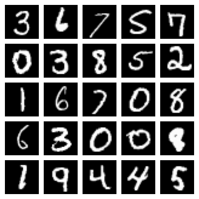
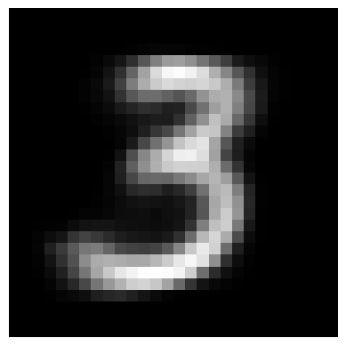
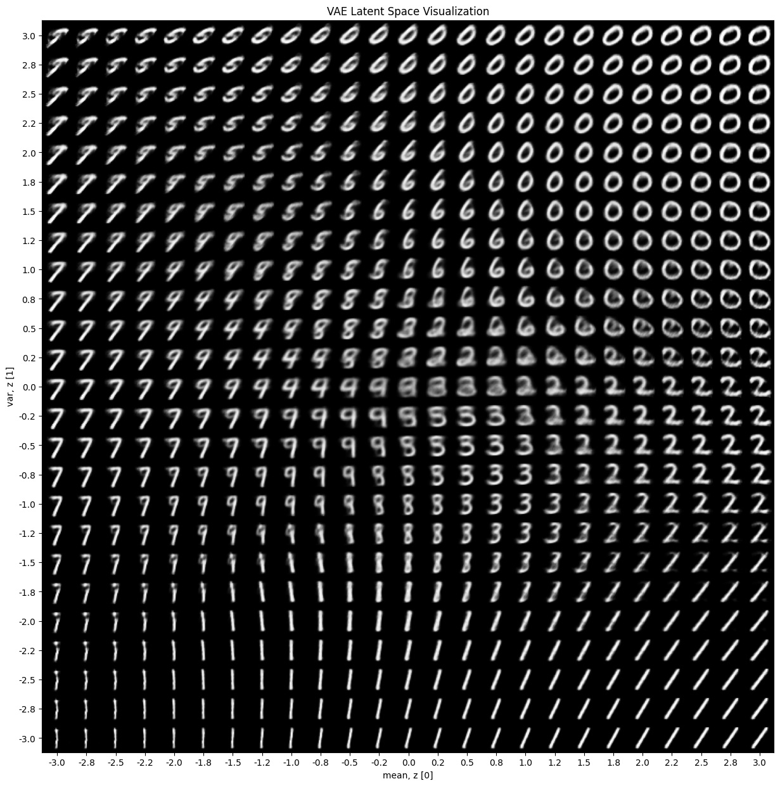

!!! success inline end "Deadline and Submission"

    :date: 26.oct (sunday)
    
    :clock1: Commits until 23:59

    :material-account: Individual

    :simple-github: Submission the GitHub Pages' Link (yes, **only** the link for pages) via [insper.blackboard.com](https://insper.blackboard.com){:target="_blank"}.

**Activity: VAE Implementation**

In this exercise, you will implement and evaluate a Variational Autoencoder (VAE) on the MNIST or Fashion MNIST dataset. The goal is to understand the architecture, training process, and performance of VAEs.


0. **Imports and dependencies**:
Before starting with the implementation, these are all the libraries that were used when executing all the code respective of this activity. It is worthy of note that torch was uysed to simplify the creation, training and execution of the VAE model.
```Python
import torch
import numpy as np
import torch.nn as nn
import torch.nn.functional as F
import matplotlib.pyplot as plt
from torchvision.datasets import MNIST
from torch.utils.data import DataLoader
import torchvision.transforms as transforms
from mpl_toolkits.axes_grid1 import ImageGrid
```

## Instructions

### 1. **Data Preparation**:

    - Load the MNIST/Fashion MNIST dataset;
    - Normalize the images to the range [0, 1];
    - Split the dataset into training and validation sets.

To load the dataset we create a transform to apply to each datapoint, this converts the images into tensor inputs to feed the neural network. By creating this transform, we can load all the images and separate them into train and test datasets.

```Python
# create a transofrm to apply to each datapoint
transform = transforms.Compose([transforms.ToTensor()])

# download the MNIST datasets
path = '~/datasets'
train_dataset = MNIST(path, transform=transform, download=True)
test_dataset  = MNIST(path, transform=transform, download=True)

# create train and test dataloaders
batch_size = 100
train_loader = DataLoader(dataset=train_dataset, batch_size=batch_size, shuffle=True)
test_loader = DataLoader(dataset=test_dataset, batch_size=batch_size, shuffle=False)

device = torch.device("cuda" if torch.cuda.is_available() else "cpu")
```

After loading, we can visualize the dataset by getting a batch from the training loader and then displaying a subset of images using a matplotlib figure and image grid as such:

```Python
# get 25 sample training images for visualization
dataiter = iter(train_loader)
images, labels = next(dataiter)
num_samples = 25
sample_images = [images[i, 0] for i in range(num_samples)]

fig = plt.figure(figsize=(5, 5))
grid = ImageGrid(fig, 111, nrows_ncols=(5, 5), axes_pad=0.1)

for ax, im in zip(grid, sample_images):
    ax.imshow(im, cmap='gray')
    ax.axis('off')

plt.show()
```




### 2. **Model Implementation**:

    - Define the VAE architecture, including the encoder and decoder networks;
    - Implement the reparameterization trick.

For the implementation of the model, we create a VAE class as a pytorch module, with input dimensions equivalent to a flattened MNIST image size (28x28=784). For visualization and clarity purpose, the latent space was set to 2 dimensions, allowing for a proper 2D visualization:
```Python
class VAE(nn.Module):
    def __init__(self, input_dim=784, hidden_dim=400, latent_dim=2):

        super().__init__()
        self.input_dim = input_dim
        self.hidden_dim = hidden_dim
        self.latent_dim = latent_dim

```
The encoder reduces the input image to a smaller hidden representation using a linear layer and a LeakyReLU activation. Two additional layers then produce the mean and log-variance that define the latent space. The decoder does the opposite: it takes a latent vector, expands it through linear layers with LeakyReLU, and uses a final Sigmoid layer to reconstruct the image with pixel values between 0 and 1.
```Python
        # encoder
        self.encoder_fc = nn.Sequential(
            nn.Linear(input_dim, hidden_dim),
            nn.LeakyReLU(0.2),
        )
        # mean and logvar heads (each outputs latent_dim)
        self.mean_layer = nn.Linear(hidden_dim, latent_dim)
        self.logvar_layer = nn.Linear(hidden_dim, latent_dim)

        # decoder
        self.decoder = nn.Sequential(
            nn.Linear(latent_dim, hidden_dim),
            nn.LeakyReLU(0.2),
            nn.Linear(hidden_dim, input_dim),
            nn.Sigmoid(),  
        )

```

Now we can define the functions that carry out the main operations needed to train and use the model.

**encode()**:

This function passes the input through the encoder to produce two outputs: the mean and log-variance, which describe the latent distribution representing the input image.
```Python
    def encode(self, x):

        h = self.encoder_fc(x)
        mean = self.mean_layer(h)
        logvar = self.logvar_layer(h)
        return mean, logvar
```
**reparameterize()**:

In a Variational Autoencoder (VAE), the encoder doesn’t output a single latent vector — it outputs a distribution (defined by a mean and a variance).
From this distribution, we need to sample a latent vector 𝑧 to pass into the decoder.

The reparameterization trick allows the model to sample from a distribution in a way that still permits backpropagation. Instead of sampling directly, we use the operation defined as:

\[
z = \mu + \sigma \cdot \epsilon
\]

where:

- \( z \) — the sampled latent vector passed to the decoder.  
- \( \mu \) — the mean of the latent distribution for the input.  
- \( \sigma \) — the standard deviation, representing the spread of the distribution.  
- \( \epsilon \) — random noise drawn from a standard normal distribution \( \mathcal{N}(0, 1) \), introducing stochasticity into the sampling process.
```Python
    def reparameterize(self, mean, logvar):

        # std from logvar:
        std = torch.exp(0.5 * logvar)
        eps = torch.randn_like(std)   # ensures same device/dtype
        z = mean + std * eps
        return z
```

**decode()**:

This function takes the latent vector 
𝑧 and reconstructs the original image by passing it through the decoder network.
```Python
    def decode(self, z):
        return self.decoder(z)
```

**forward()**:

This function combines the full process of the VAE: it encodes the input to obtain the mean and log-variance, samples a latent vector 
𝑧, and then decodes it to reconstruct the image output.
```Python
    def forward(self, x):
        mean, logvar = self.encode(x)
        z = self.reparameterize(mean, logvar)
        x_hat = self.decode(z)
        return x_hat, mean, logvar
```

### 3. **Training**:

    - Train the VAE on the MNIST/Fashion MNIST dataset;
    - Monitor the loss and generate reconstructions during training.

To train the VAE, the model is initialized with an input dimension of 784 (flattened 28×28 MNIST images), a hidden layer of 400 units, and a 2-dimensional latent space for visualization. The Adam optimizer is used with a learning rate of 0.001 to update the model’s parameters during training.
```Python
model = VAE(input_dim=784, hidden_dim=400, latent_dim=2).to(device)

optimizer = torch.optim.Adam(model.parameters(), lr=1e-3)
```
The loss function combines two terms: a **reconstruction loss** (binary cross-entropy) that measures how well the output image matches the input, and a **Kullback–Leibler divergence (KLD)**, a term that is used to regularize the latent space. It measures how much the learned latent distribution \( q(z|x) \) (defined by the encoder’s mean and variance) differs from a standard normal distribution \( p(z) = \mathcal{N}(0, I) \). 
```Python
def loss_function(x, x_hat, mean, log_var):
    reproduction_loss = nn.functional.binary_cross_entropy(x_hat, x, reduction='sum')
    KLD = - 0.5 * torch.sum(1+ log_var - mean.pow(2) - log_var.exp())

    return reproduction_loss + KLD
```

During training, the model iterates through all batches for each epoch. Each image is flattened and passed through the VAE to obtain its reconstruction, mean, and log-variance. The total loss (reconstruction + KLD) is computed, gradients are backpropagated, and the optimizer updates the weights. After every epoch, the average loss is printed to track the model’s progress.
```Python
def train(model, optimizer, train_loader, loss_function, epochs, device):
    model.train()
    for epoch in range(epochs):
        overall_loss = 0
        for batch_idx, (x, _) in enumerate(train_loader):
            # Flatten the batch dynamically (no need for x_dim or batch_size)
            x = x.view(x.size(0), -1).to(device)

            optimizer.zero_grad()
            x_hat, mean, log_var = model(x)
            loss = loss_function(x, x_hat, mean, log_var)
            
            overall_loss += loss.item()
            
            loss.backward()
            optimizer.step()

        avg_loss = overall_loss / len(train_loader.dataset)
        print(f"Epoch {epoch+1} \t Average Loss: {avg_loss:.4f}")

train(model, optimizer, train_loader, loss_function, epochs=50, device=device)
```

### 4. **Evaluation**:

    - Evaluate the VAE's performance on the validation set;
    - Generate new samples from the learned latent space.

During the validation process, the trained VAE is evaluated on unseen test data to measure how well it generalizes beyond the training set. Each image is passed through the encoder and decoder to obtain its reconstruction, and the same loss function used in training is computed — combining reconstruction loss and Kullback–Leibler divergence (KLD). The reconstruction loss measures how accurately the model reproduces the input, while the KLD ensures that the latent space remains properly regularized. The average of these losses over the entire validation set provides an overall measure of model performance.

```Python
def evaluate_vae(model, data_loader, loss_function, device):
    model.eval()  # set model to evaluation mode
    total_loss = 0
    recon_loss_total = 0
    kl_loss_total = 0

    with torch.no_grad():
        for x, _ in data_loader:
            # Flatten input and move to the selected device
            x = x.view(x.size(0), -1).to(device)

            # Forward pass through the VAE
            x_hat, mean, log_var = model(x)

            # Compute reconstruction loss (BCE) and KL divergence
            recon_loss = F.binary_cross_entropy(x_hat, x, reduction='sum')
            kl_loss = -0.5 * torch.sum(1 + log_var - mean.pow(2) - log_var.exp())

            # Total loss per batch
            loss = recon_loss + kl_loss

            total_loss += loss.item()
            recon_loss_total += recon_loss.item()
            kl_loss_total += kl_loss.item()

    # Average losses per sample
    num_samples = len(data_loader.dataset)
    avg_total_loss = total_loss / num_samples
    avg_recon_loss = recon_loss_total / num_samples
    avg_kl_loss = kl_loss_total / num_samples

    print(f"Validation Results:")
    print(f"  Average Total Loss: {avg_total_loss:.4f}")
    print(f"  Average Reconstruction Loss: {avg_recon_loss:.4f}")
    print(f"  Average KL Divergence: {avg_kl_loss:.4f}")

    return avg_total_loss, avg_recon_loss, avg_kl_loss


evaluate_vae(model, test_loader, loss_function, device)
```
The validation results show an average total loss of 148.53, composed of a reconstruction loss of 142.32 and a Kullback–Leibler divergence (KLD) of 6.20. The reconstruction loss measures how accurately the VAE can reproduce the input images — lower values indicate better reconstructions. The KLD term evaluates how close the learned latent space is to a standard normal distribution, helping maintain a smooth and continuous latent structure. The relatively low total loss and balanced KLD suggest that the model has learned to generate clear, realistic digits while keeping the latent space well organized.
```text
Validation Results:
  Average Total Loss: 148.5260
  Average Reconstruction Loss: 142.3252
  Average KL Divergence: 6.2008
```
### 5. **Visualization**:

    - Visualize original and reconstructed images;
    - Visualize the latent space (in case of a latent space until 3-D, otherwise use a reduced visualization, e.g., using t-SNE, UMAP or PCA).

After training the model, we can visualize how different points in the latent space correspond to generated digits. The `generate_digit()` function creates a new image by manually setting the two latent variables \( z_1 \) and \( z_2 \), which represent coordinates in the 2D latent space. These values are inserted into a zero vector, passed through the decoder, and displayed as a reconstructed digit.

```Python
def generate_digit(z1=0.0, z2=0.0):
    model.eval()
    with torch.no_grad():
        latent_dim = 2
        z_sample = torch.zeros((1, latent_dim), dtype=torch.float).to(device)
        z_sample[0, 0] = z1   # vary first latent coordinate
        z_sample[0, 1] = z2   # vary second latent coordinate

        # decode to image
        x_decoded = model.decode(z_sample)
        digit = x_decoded.detach().cpu().view(28, 28)

    plt.imshow(digit, cmap='gray')
    plt.axis('off')
    plt.show()

generate_digit(1.0, -1.0)
```


The `plot_latent_space()` function expands this idea to visualize the entire 2D latent space. It generates a grid of \( n \times n \) points, each representing a pair of latent coordinates \((z_1, z_2)\), decodes them into images, and arranges them into a single figure. The result shows how smoothly the VAE’s decoder transitions between digits across the latent space, demonstrating that similar latent points produce similar digits.
```Python
def plot_latent_space(model, scale=1.0, n=25, digit_size=28, figsize=15):
    # display a n*n 2D manifold of digits
    figure = np.zeros((digit_size * n, digit_size * n))

    # construct a grid 
    grid_x = np.linspace(-scale, scale, n)
    grid_y = np.linspace(-scale, scale, n)[::-1]

    for i, yi in enumerate(grid_y):
        for j, xi in enumerate(grid_x):
            z_sample = torch.tensor([[xi, yi]], dtype=torch.float).to(device)
            x_decoded = model.decode(z_sample)
            digit = x_decoded[0].detach().cpu().reshape(digit_size, digit_size)
            figure[i * digit_size : (i + 1) * digit_size, j * digit_size : (j + 1) * digit_size,] = digit

    plt.figure(figsize=(figsize, figsize))
    plt.title('VAE Latent Space Visualization')
    start_range = digit_size // 2
    end_range = n * digit_size + start_range
    pixel_range = np.arange(start_range, end_range, digit_size)
    sample_range_x = np.round(grid_x, 1)
    sample_range_y = np.round(grid_y, 1)
    plt.xticks(pixel_range, sample_range_x)
    plt.yticks(pixel_range, sample_range_y)
    plt.xlabel("mean, z [0]")
    plt.ylabel("var, z [1]")
    plt.imshow(figure, cmap="Greys_r")
    plt.show()


plot_latent_space(model, scale=3.0, n=25, digit_size=28, figsize=15)
```

!!! danger "Important Guidelines"

    This is an **individual activity**. You must complete the work on your own. Collaboration is not allowed, but you can discuss general concepts with your peers or instructors;
    
    You could use the scratch MLP built in the exercise before, but you can use any framework you prefer (e.g., PyTorch, TensorFlow, Keras), also AI tools can be used to help you in the implementation. ==BUT== remember that the main goal is to understand the VAE architecture and training process, then **you must be able to explain all parts of the code and analysis submitted**.

**Important Notes:**

- The deliverable must be submitted in the format specified: **GitHub Pages**. **No other formats will be accepted.** - there exists a template for the course that you can use to create your GitHub Pages - [template](https://hsandmann.github.io/documentation.template/){target='_blank'};

- There is a **strict policy against plagiarism**. Any form of plagiarism will result in a zero grade for the activity and may lead to further disciplinary actions as per the university's academic integrity policies;

- **The deadline for each activity is not extended**, and it is expected that you complete them within the timeframe provided in the course schedule - **NO EXCEPTIONS** will be made for late submissions.

- **AI Collaboration is allowed**, but each student **MUST UNDERSTAND** and be able to explain all parts of the code and analysis submitted. Any use of AI tools must be properly cited in your report. **ORAL EXAMS** may require you to explain your work in detail.

- All deliverables for individual activities should be submitted through the course platform [insper.blackboard.com](http://insper.blackboard.com/){:target="_blank"}.


**Grade Criteria:**

| Criteria | Description |
|:--------:|-------------|
| **3 pts** | Correctness of the VAE implementation |
| **1 pts** | Training and Evaluation: Proper training procedure, loss monitoring, and evaluation on the validation set. |
| **2 pts** | Sampling: Quality of generated samples. |
| **2 pts** | Latent Space: Quality of the learned latent space representation. |
| **1 pts** | Visualizations: Quality and clarity of plots (data distribution, decision boundary, accuracy over epochs). |
| **1 pt** | Report Quality: Clarity, organization, and completeness of the report. |